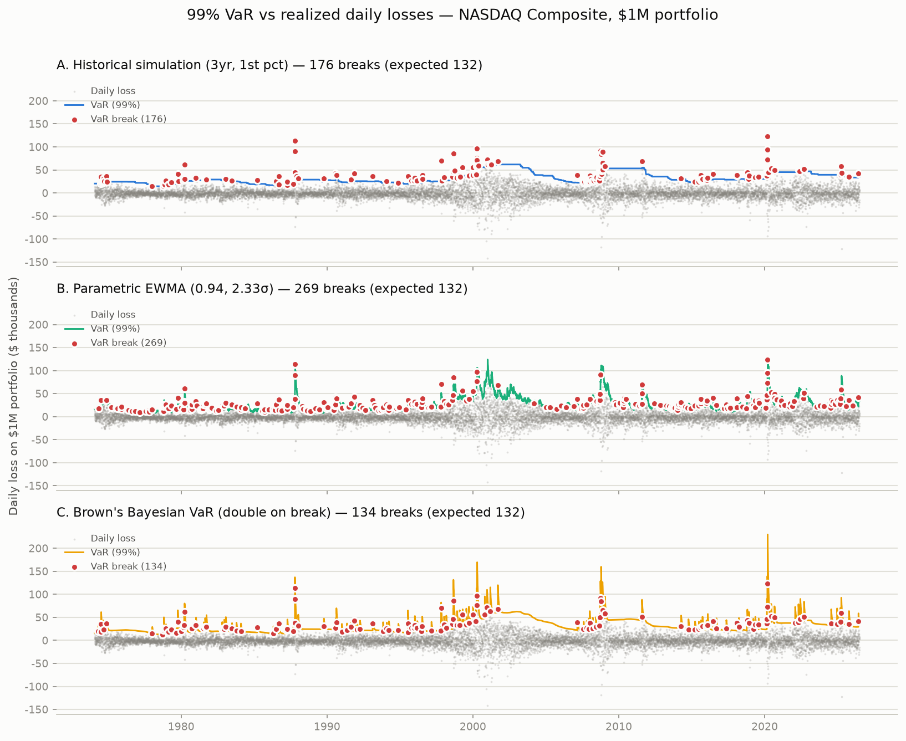
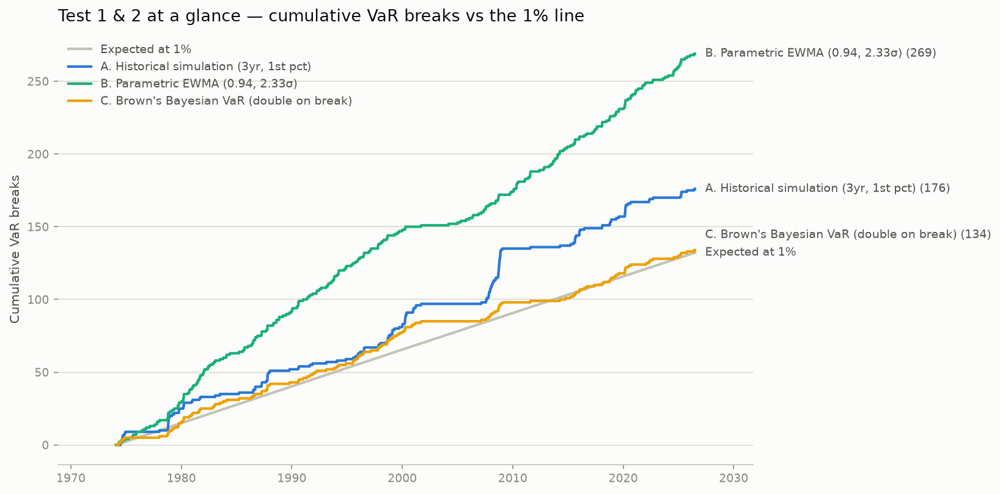
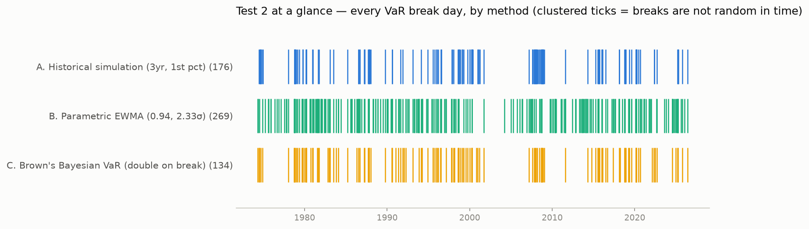

# VaR backtest report — NASDAQ Composite

Three daily 99% VaR estimators for a **$1,000,000** position in the
NASDAQ Composite (FRED `NASDAQCOM`), scored against the three tests in
Aaron Brown's *"Forced by the Sternest Circumstances"* (Wilmott, 2009):

> 1. The actual fraction of VaR break days is 1 percent, within statistical tolerance;
> 2. The VaR breaks are randomly distributed in time;
> 3. The VaR breaks are independent of the level of VaR.

Backtest window: **1974-01-29 to 2026-07-02** (13,218 daily VaR predictions after a 750-day warm-up).
A *break* is a day the portfolio loses more than its VaR. Pass/fail tolerance: p ≥ 0.05 on the tests shown.

## Scorecard

| Method | Breaks (obs/exp) | Test 1: frequency | Test 2: random in time | Test 3: independent of level |
|---|---|---|---|---|
| A. Historical simulation (3yr, 1st pct) | 176 / 132 exp. | FAIL | FAIL | FAIL |
| B. Parametric EWMA (0.94, 2.33σ) | 269 / 132 exp. | FAIL | FAIL | FAIL |
| C. Brown's Bayesian VaR (double on break) | 134 / 132 exp. | PASS | PASS | FAIL |

### Reading the results

The textbook methods fail the same way they do in the article. Historical simulation gives 176 breaks instead of 132, and 19 of them land the very next day after another break where independence would predict about 2 — volatility clusters, and a 3-year window cannot see it. Parametric EWMA is worse on frequency (269 breaks) and just as clustered. Both also break disproportionately on days when they say things are safe. Brown's double-on-break rule — the article's parameters untouched, nothing fitted to this data — passes Tests 1 and 2 outright. On this NASDAQ series it narrowly fails Test 3: its average VaR on break days ($29,436) sits about 10% below its overall average ($32,552), p = 0.018. That is a marginal miss on the bad side (the article's S&P run erred slightly the other way), not the decisive failure of the other two methods — but a nonrubber-stamp backtest reports it as a failure all the same.

## Method detail

### A. Historical simulation (3yr, 1st pct)

1st percentile of the last 750 daily returns — the "distribution-free" method in every textbook.

**Test 1 — break frequency is 1%: FAIL**

| Metric | Value |
|---|---|
| Observations | 13,218 |
| VaR breaks | 176 |
| Expected breaks (1%) | 132 |
| Observed break rate | 1.33% |
| z-score vs 1% | +3.8 |
| Kupiec POF p-value | 0.00027 |

**Test 2 — breaks randomly distributed in time: FAIL**

| Metric | Observed | Expected if independent | p-value |
|---|---|---|---|
| Breaks the day after a break | 19 | 2.3 | 3.9e-12 |
| Breaks within 10 days of a break | 80 | 22.0 | 4.1e-27 |
| Christoffersen independence test | — | — | 1.9e-12 |

**Test 3 — breaks independent of the VaR level: FAIL**

| Metric | Value |
|---|---|
| Average VaR | $31,759 |
| Average VaR on break days | $29,205 |
| Ratio (break days / all days) | 0.92 |
| Permutation test p-value (are break days a random sample of days?) | 0.0022 |
| Welch t-test p-value (break vs non-break days) | 0.0019 |

**Verdict: not a VaR** — fails test(s) 1, 2, 3.

### B. Parametric EWMA (0.94, 2.33σ)

RiskMetrics: variance = 0.94 x yesterday's variance + 0.06 x today's move squared; VaR = 2.33 standard deviations.

**Test 1 — break frequency is 1%: FAIL**

| Metric | Value |
|---|---|
| Observations | 13,218 |
| VaR breaks | 269 |
| Expected breaks (1%) | 132 |
| Observed break rate | 2.04% |
| z-score vs 1% | +12.0 |
| Kupiec POF p-value | 9.5e-26 |

**Test 2 — breaks randomly distributed in time: FAIL**

| Metric | Observed | Expected if independent | p-value |
|---|---|---|---|
| Breaks the day after a break | 16 | 5.5 | 0.00015 |
| Breaks within 10 days of a break | 74 | 49.8 | 0.00028 |
| Christoffersen independence test | — | — | 0.00017 |

**Test 3 — breaks independent of the VaR level: FAIL**

| Metric | Value |
|---|---|
| Average VaR | $25,806 |
| Average VaR on break days | $20,952 |
| Ratio (break days / all days) | 0.81 |
| Permutation test p-value (are break days a random sample of days?) | < 0.0002 |
| Welch t-test p-value (break vs non-break days) | 1.6e-11 |

**Verdict: not a VaR** — fails test(s) 1, 2, 3.

### C. Brown's Bayesian VaR (double on break)

Start from 2.33 x 3-year standard deviation. After a break, double the estimate; otherwise 0.94 x yesterday's estimate + 0.06 x the simple estimate.

**Test 1 — break frequency is 1%: PASS**

| Metric | Value |
|---|---|
| Observations | 13,218 |
| VaR breaks | 134 |
| Expected breaks (1%) | 132 |
| Observed break rate | 1.01% |
| z-score vs 1% | +0.2 |
| Kupiec POF p-value | 0.87 |

**Test 2 — breaks randomly distributed in time: PASS**

| Metric | Observed | Expected if independent | p-value |
|---|---|---|---|
| Breaks the day after a break | 4 | 1.3 | 0.047 |
| Breaks within 10 days of a break | 17 | 12.9 | 0.24 |
| Christoffersen independence test | — | — | 0.063 |

**Test 3 — breaks independent of the VaR level: FAIL**

| Metric | Value |
|---|---|
| Average VaR | $32,552 |
| Average VaR on break days | $29,436 |
| Ratio (break days / all days) | 0.90 |
| Permutation test p-value (are break days a random sample of days?) | 0.018 |
| Welch t-test p-value (break vs non-break days) | 0.024 |

**Verdict: not a VaR** — fails test(s) 3.

## "Should we try for two out of three?" — recalibrated variants

As in the article, the failing methods can be forced to pass Test 1 by
moving the percentile / sigma multiplier until the break count is exactly
the expected number. They still fail the other tests — the miscalibration
is not the problem, the clustering is.

| Method | Breaks (obs/exp) | Test 1: frequency | Test 2: random in time | Test 3: independent of level |
|---|---|---|---|---|
| A2. Historical simulation recalibrated (0.69 pct) | 132 / 132 exp. | PASS | FAIL | FAIL |
| B2. Parametric recalibrated (2.94σ) | 133 / 132 exp. | PASS | FAIL | FAIL |

### A2. Historical simulation recalibrated (0.69 pct)

Percentile moved from 1.00 to 0.69 so the break count is as close as possible to the expected 132.

**Test 1 — break frequency is 1%: PASS**

| Metric | Value |
|---|---|
| Observations | 13,218 |
| VaR breaks | 132 |
| Expected breaks (1%) | 132 |
| Observed break rate | 1.00% |
| z-score vs 1% | -0.0 |
| Kupiec POF p-value | 0.99 |

**Test 2 — breaks randomly distributed in time: FAIL**

| Metric | Observed | Expected if independent | p-value |
|---|---|---|---|
| Breaks the day after a break | 14 | 1.3 | 8.1e-11 |
| Breaks within 10 days of a break | 56 | 12.5 | 2.3e-23 |
| Christoffersen independence test | — | — | 4.6e-11 |

**Test 3 — breaks independent of the VaR level: FAIL**

| Metric | Value |
|---|---|
| Average VaR | $34,797 |
| Average VaR on break days | $31,138 |
| Ratio (break days / all days) | 0.89 |
| Permutation test p-value (are break days a random sample of days?) | < 0.0002 |
| Welch t-test p-value (break vs non-break days) | 0.00022 |

**Verdict: not a VaR** — fails test(s) 2, 3.

### B2. Parametric recalibrated (2.94σ)

Sigma multiplier moved from 2.33 to 2.94 so the break count is as close as possible to the expected 132.

**Test 1 — break frequency is 1%: PASS**

| Metric | Value |
|---|---|
| Observations | 13,218 |
| VaR breaks | 133 |
| Expected breaks (1%) | 132 |
| Observed break rate | 1.01% |
| z-score vs 1% | +0.1 |
| Kupiec POF p-value | 0.94 |

**Test 2 — breaks randomly distributed in time: FAIL**

| Metric | Observed | Expected if independent | p-value |
|---|---|---|---|
| Breaks the day after a break | 8 | 1.3 | 6.4e-05 |
| Breaks within 10 days of a break | 24 | 12.7 | 0.0026 |
| Christoffersen independence test | — | — | 6.4e-05 |

**Test 3 — breaks independent of the VaR level: FAIL**

| Metric | Value |
|---|---|
| Average VaR | $32,577 |
| Average VaR on break days | $25,514 |
| Ratio (break days / all days) | 0.78 |
| Permutation test p-value (are break days a random sample of days?) | < 0.0002 |
| Welch t-test p-value (break vs non-break days) | 6.8e-08 |

**Verdict: not a VaR** — fails test(s) 2, 3.

---
*Generated by `var_backtest.py`. Data: FRED NASDAQCOM (blank*
*observations, i.e. market holidays, dropped as missing).*
