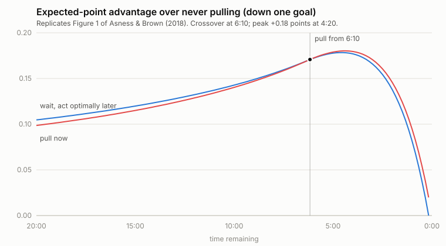

# Pulling the Goalie

A replication of **Asness & Brown (2018), "Pulling the Goalie: Hockey and
Investment Implications"** ([SSRN 3132563](https://ssrn.com/abstract=3132563)),
plus an interactive webpage that teaches the calculation itself — how three
probabilities and a backward induction produce the famous answer that a team
down one goal should pull its goalie with **6:10** left, not in the final minute.



## What's here

| File | What it is |
|---|---|
| [`index.html`](index.html) | Self-contained educational webpage. Walks the reader from the three inputs to the full optimal policy in six steps, with the worked 10-second example that produces the "a-ha", an animated replay of the backward induction, and a playground that re-solves the model live as you drag the inputs. No dependencies, no network calls — open it in any browser. |
| [`pull_goalie.py`](pull_goalie.py) | The model in ~300 lines of standard-library Python: the dynamic program, the replication report, CSV/SVG export, and a Monte Carlo validator that plays synthetic seasons. |
| [`results/`](results/) | Generated outputs: pull-time thresholds, the Figure 1 series, comparative statics, and the SVG figure above. |

## The model in one paragraph

Slice the game into 10-second intervals. From the 2015–16 NHL season, each team
scores in an even-strength slice with probability **0.65%** (4,947 goals /
126,425 minutes / 6). With a net empty, the pulling team scores at **1.97%**
and concedes at **4.30%** (from 2,206 minutes of 6-on-5 play). Standings points:
win 2, regulation tie 1.5 (expected value of overtime), loss 0. Let the state be
(score differential, time remaining) and solve backwards from the final horn:
`EPNP` (never pull), `EPNO` (goalie in for this slice, optimal afterwards) and
`EPPO` (net empty for this slice, optimal afterwards), with continuation value
`V = max(EPPO, EPNO)`. Pull wherever `EPPO > EPNO`.

The a-ha inside the arithmetic: pulling is a *terrible* trade in goals
(danger ×6.6, firepower ×3), but the scoreboard pays in points, and losing by
two pays exactly what losing by one pays — zero. Near the end of a game the
entire downside of pulling is multiplied by zero, so buying goal-volatility is
free insurance. Equivalently: pull when
`(value of tying) > 2.77 × (cost of falling two behind)`, where
2.77 = (4.30 − 0.65)/(1.97 − 0.65). That inequality first holds at 6:10.

## Replication results

```
Result                                         Paper     Here
--------------------------------------------------------------
Pull when down 1, time remaining                6:10     6:10
Pull when down 2, time remaining               13:00    13:00
Pull when down 3, time remaining               23:40    20:00  †
Pull when down 4, time remaining            any time    26:50  †
Peak advantage vs never pulling (down 1)        0.18    0.180
  ...occurs with time remaining                 4:20     4:20
Season value of optimal pulling, pts/game       0.05    0.051
  ...over an 82-game season                     4.18     4.15
All scoring doubled  -> pull (down 1)          ~3:00     3:00
All scoring halved   -> pull (down 1)         >12:00    12:20
Pull offense -25%    -> pull (down 1)          ~4:00     4:10
Pull offense -60%    -> pull (down 1)          ~1:00     1:00
```

**† The deep-deficit caveat.** Near the down-3/down-4 boundaries the
pull-vs-wait value gap is on the order of 10⁻⁴ standings points — the decision
surface is nearly flat, so the exact threshold is sensitive to implementation
details. We could not reproduce the paper's 23:40 with either the corrected
inputs (20:00 on our grid) or the pre-correction draft's inputs (17:40, which
does reproduce the old draft's 5:40 down-1 figure cited in the paper's
footnote 14). Nothing decision-relevant depends on it; "down four → pull any
time" is a fair rounding of a threshold that costs under 0.001 points to
ignore. One more archaeological note: the paper's sentence that pulling
"nearly quadruples" the opponent's chance while "not even doubling" your own
matches the pre-correction numbers (2.58%/1.18%); with the corrected inputs
the ratios are 6.6× and 3.0×.

## Monte Carlo validation (synthetic data)

`--simulate` plays full synthetic games at 10-second resolution under three
policies and averages standings points, validating the dynamic program with
data the model did not compute analytically:

```
$ python3 pull_goalie.py --simulate 200000
Never pull                                     1.0952 pts/game
NHL convention (last minute, down 1-2)         1.1123 pts/game
Optimal policy                                 1.1465 pts/game
Optimal minus never (model says ~0.051)       +0.0513
```

Note the middle row: the conventional last-minute pull captures only about a
third of the available edge.

## Running it

```bash
python3 pull_goalie.py                     # replication report (no deps)
python3 pull_goalie.py --export results    # regenerate CSVs + figure1.svg
python3 pull_goalie.py --simulate 200000   # Monte Carlo validation (~40s)
```

Open `index.html` directly in a browser (everything is computed client-side).

## Data sources

The paper's inputs are three season aggregates from **2015–16 NHL** play, all
reproduced above — no further data is needed to replicate it. To rebuild or
update the inputs from raw data, the usual sources for situation-split (5v5 /
6v5 / empty-net) goals and time-on-ice are:

- [Natural Stat Trick](https://www.naturalstattrick.com/) — team/season tables by game state
- [MoneyPuck](https://moneypuck.com/data.htm) — free shot-level CSVs with empty-net flags
- [Evolving-Hockey](https://evolving-hockey.com/) and [Hockey-Reference](https://www.hockey-reference.com/)
- The NHL Stats API (`api-web.nhle.com`)

## Citation

Asness, Clifford S. and Brown, Aaron, *Pulling the Goalie: Hockey and
Investment Implications* (October 1, 2018). Available at SSRN:
<https://ssrn.com/abstract=3132563>.

*An independent educational replication — not affiliated with or endorsed by
the authors or AQR.*
